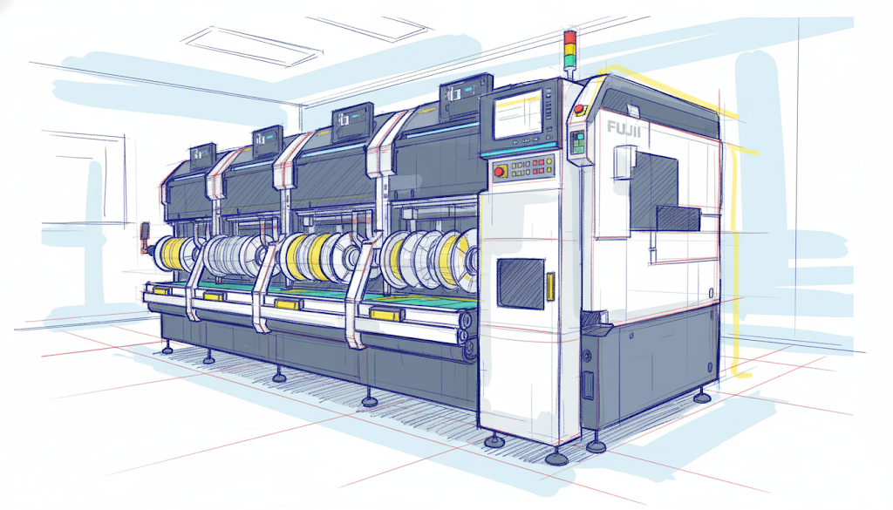

<h1 align="center">Hi, I'm CallMeTechie 👋</h1>

<em>Service Engineer @ Fuji Europe &nbsp;·&nbsp; Web developer by night</em>

---

### 🧑‍💻 About me

By day I keep machines running as a Service Engineer at **Fuji Europe** —
by night I build web apps for my homelab and small private projects.
I like clean code, well-thought-out self-hosting setups, and tools that take work off my hands.

- 🔧 Focus: web apps, automation & homelab infrastructure
- 🌍 Working in both German & English
- 🏡 Self-hosting enthusiast (Synology, Docker, my own services)

---

### 🏭 By day: the heart of Fuji's NXT & NXT-R

<table>
<tr>
<td width="46%"></td>
<td valign="middle">

My specialty: the **placement heads** of Fuji's **NXT and NXT-R**
surface-mount (SMT) platforms — the precision units that pick up thousands
of components per hour and set them onto circuit boards with sub-millimetre
accuracy.

I maintain and repair these heads across the whole range, down to the
smallest part. Over the years that focus turned into a niche of its own —
when an NXT or NXT-R head needs to come back to life somewhere in Europe,
I'm often the one who gets the call. Mechanics, pneumatics, optics and
electronics packed into one tight assembly, and I know my way around all
of them.

> 💬 There's something deeply satisfying about stripping a worn, failing head
> down to the last screw, hunting down the fault, and handing back a unit
> that runs like new. That's my kind of puzzle.

</td>
</tr>
</table>

---

### 🛠️ Tech Stack

---

### 🚀 Projects

| Project | What it does |
|---|---|
| **[GateControl](https://github.com/CallMeTechie/gatecontrol)** | Unified WireGuard VPN + Caddy reverse-proxy management. |
| **[MailPilot AI](https://github.com/CallMeTechie/mailpilot-ai)** | AI-powered Outlook add-in for email triage. |
| **[Synology Manager Plus](https://github.com/CallMeTechie/synology-manager-plus)** | Synology NAS plugin with automated SSH setup & health diagnostics. |
| **[Fleet Manager](https://github.com/CallMeTechie/fleet-manager)** | Claude Code plugin to manage a fleet of Linux servers over SSH. |

---

### 📫 Get in touch

⚙️ Always tinkering — there's always something running in a Docker container around here.
